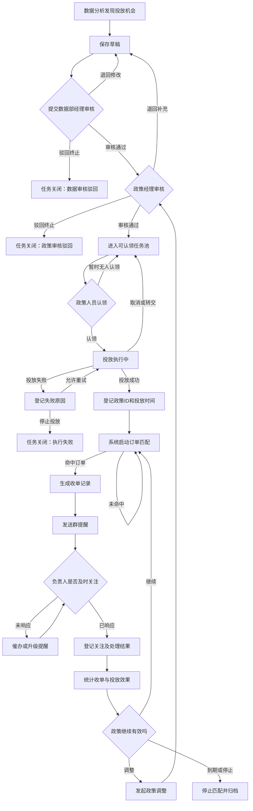
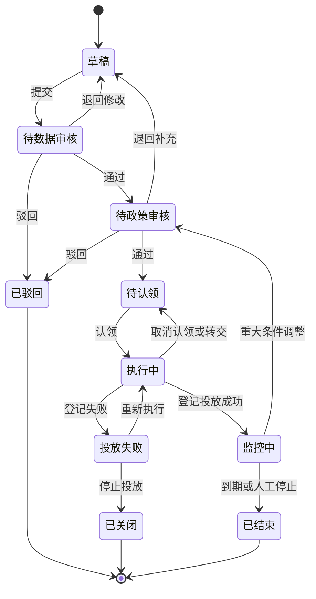
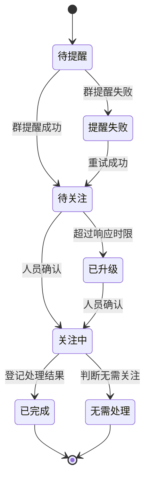

# 智能投放需求流转草案

> 文档状态：用户于2026-10-09确认总体流程没有问题；字段和功能细节待数据部、政策部共同评审  
> 编写日期：2026-10-09  
> 本文只描述业务流程、功能点和字段，不代表最终数据库设计。  
> 现有 HTML 原型暂不修改，待本文确认后再进入页面、表结构和接口设计。

## 1. 建设目标

智能投放需要形成以下业务闭环：

1. 数据部通过分析发现值得投放的政策机会。
2. 数据部经理确认数据口径和预估价值。
3. 政策经理确认政策是否可执行。
4. 政策人员从任务池认领并完成外部政策投放。
5. 投放人员登记政策 ID、投放时间和有效范围。
6. 系统使用已登记的政策条件匹配后续订单。
7. 命中订单后发送群提醒，并要求相关人员及时关注。
8. 系统统计收单、利润、响应时效及政策效果，为后续继续、调整或停止投放提供依据。

## 2. 参与角色

| 角色 | 主要职责 | 关键权限 |
| --- | --- | --- |
| 数据分析人员 | 发现机会、填写分析结论、提交审核 | 新建、编辑、提交、撤回本人未审核任务 |
| 数据部经理 | 审核数据口径、机会价值和分析依据 | 通过、退回、驳回、调整优先级 |
| 政策经理 | 判断政策可执行性、风险和资源安排 | 通过、退回、驳回、指定认领范围 |
| 政策人员 | 认领、执行投放、登记外部政策信息 | 认领、转交申请、登记成功或失败 |
| 来单关注人员 | 接收提醒、关注订单、反馈结果 | 确认关注、登记处理结果 |
| 系统管理员 | 维护人员、角色、规则及消息渠道 | 配置和审计，不参与日常审批 |
| 系统任务 | 匹配订单、发送提醒、统计时效与效果 | 自动运行并记录执行日志 |

> 待确认：政策人员与来单关注人员是否为同一个人；数据管理员是否可以代办所有环节。

## 3. 主流程图

## 4. 状态流转图

建议把“投放任务”和“命中订单”拆成两套状态，避免一个状态字段同时描述两类业务。

### 4.1 投放任务状态

### 4.2 命中订单状态

## 5. 功能流转与字段

### 5.1 步骤一：数据分析机会入池

#### 功能点

- 支持分析规则自动生成，也支持数据人员手工新建。
- 自动带出分析区间、指标结果和推荐投放条件。
- 保存草稿后可以继续补充，提交后进入数据部经理审核。
- 提交前检查必填字段和是否存在重复机会。

#### 字段

| 字段 | 是否必填 | 录入方式 | 用途 |
| --- | --- | --- | --- |
| 任务编号 | 是 | 系统生成 | 系统内部唯一编号 |
| 机会名称 | 是 | 人工填写/规则生成 | 快速描述本次投放机会 |
| 机会来源 | 是 | 系统选择 | 自动分析、人工发现、会议要求等 |
| 分析规则编号 | 条件必填 | 系统生成 | 自动分析产生时关联规则版本 |
| 分析开始日期 | 是 | 人工或系统带入 | 明确分析样本范围 |
| 分析结束日期 | 是 | 人工或系统带入 | 明确分析样本范围 |
| 平台 | 是 | 选择 | 订单匹配维度之一 |
| 站点 | 待确认 | 选择 | 是否精确到具体业务站点 |
| 航司 | 是 | 选择 | 订单匹配维度之一 |
| 出发地 | 待确认 | 选择/多选 | 支持城市或机场口径 |
| 到达地 | 待确认 | 选择/多选 | 支持城市或机场口径 |
| 航程类型 | 否 | 选择 | 单程、往返、多程 |
| 航班号 | 否 | 填写/多选 | 需要精确到航班时使用 |
| 舱位 | 否 | 填写/多选 | 需要精确到舱位时使用 |
| 产品类型 | 否 | 选择 | 如公布转私有等 |
| 出票日期范围 | 待确认 | 日期范围 | 控制投放或订单匹配日期 |
| 起飞日期范围 | 待确认 | 日期范围 | 控制适用出行日期 |
| 建议投放方式 | 是 | 选择/填写 | 降价、补量、指定渠道等 |
| 建议价格或调整值 | 否 | 数值 | 如直减金额、加价金额 |
| 建议有效期 | 是 | 日期范围 | 建议政策生效时间 |
| 历史票数 | 是 | 系统计算 | 机会价值依据 |
| 历史航段数 | 否 | 系统计算 | 投放规模参考 |
| 历史利润 | 是 | 系统计算 | 机会价值依据 |
| 预估月票数 | 是 | 人工或系统计算 | 审核与效果对比依据 |
| 预估月利润 | 是 | 人工或系统计算 | 审核与效果对比依据 |
| 分析结论 | 是 | 人工填写 | 说明为什么值得投放 |
| 风险提示 | 否 | 人工填写 | 价格、航司、供应、投诉等风险 |
| 优先级 | 是 | 选择 | 高、中、低或数字等级 |
| 期望完成时间 | 是 | 日期时间 | 用于认领及执行 SLA |
| 附件 | 否 | 上传 | Excel、截图或分析报告 |
| 创建人/创建时间 | 是 | 系统生成 | 审计字段 |

### 5.2 步骤二：数据部经理审核

#### 功能点

- 查看分析依据、历史数据、预估价值及风险提示。
- 可通过、退回修改或驳回终止。
- 退回时回到创建人；驳回后任务关闭但保留记录。
- 可调整优先级和建议完成时间，但需要留下修改记录。

#### 字段

| 字段 | 是否必填 | 录入方式 | 用途 |
| --- | --- | --- | --- |
| 审核结果 | 是 | 选择 | 通过、退回、驳回 |
| 审核意见 | 退回/驳回必填 | 人工填写 | 说明判断依据和修改要求 |
| 数据口径确认 | 是 | 勾选 | 确认票数、利润等口径可用 |
| 样本充分性确认 | 是 | 勾选 | 确认分析样本足够支持投放 |
| 预估价值确认 | 是 | 勾选 | 确认预估结果合理 |
| 调整后优先级 | 否 | 选择 | 审核过程中允许调整 |
| 调整后完成时间 | 否 | 日期时间 | 审核过程中允许调整 |
| 审核人/审核时间 | 是 | 系统生成 | 审计字段 |

### 5.3 步骤三：政策经理审核

#### 功能点

- 判断建议政策在业务上是否可执行。
- 确认适用条件、风险、资源和可认领人员范围。
- 可通过、退回补充或驳回终止。
- 通过后进入可认领任务池。

#### 字段

| 字段 | 是否必填 | 录入方式 | 用途 |
| --- | --- | --- | --- |
| 审核结果 | 是 | 选择 | 通过、退回、驳回 |
| 审核意见 | 退回/驳回必填 | 人工填写 | 说明可执行性判断 |
| 政策可执行性 | 是 | 选择 | 可执行、有条件执行、不可执行 |
| 确认投放平台 | 是 | 选择 | 可与建议平台不同，但需记录差异 |
| 确认适用范围 | 是 | 填写/结构化选择 | 航司、航线、舱位、产品等最终范围 |
| 价格调整上限 | 否 | 数值 | 控制投放人员执行边界 |
| 风险等级 | 是 | 选择 | 高、中、低 |
| 风险控制要求 | 否 | 人工填写 | 投放限制和注意事项 |
| 可认领人员或小组 | 待确认 | 选择 | 限制谁可以看到并认领 |
| 认领截止时间 | 是 | 日期时间 | 超时后催办或升级 |
| 审核人/审核时间 | 是 | 系统生成 | 审计字段 |

### 5.4 步骤四：政策任务认领

#### 功能点

- 政策人员查看可认领池并认领任务。
- 防止两个人同时认领同一个任务。
- 支持取消认领、转交申请和经理重新分配。
- 认领后进入“执行中”，开始计算执行时效。

#### 字段

| 字段 | 是否必填 | 录入方式 | 用途 |
| --- | --- | --- | --- |
| 认领人 | 是 | 当前登录用户 | 明确任务负责人 |
| 认领时间 | 是 | 系统生成 | 计算执行时效 |
| 计划完成时间 | 是 | 人工选择 | 负责人承诺时间 |
| 认领备注 | 否 | 人工填写 | 资源或执行计划说明 |
| 所属政策小组 | 否 | 系统带出 | 后续汇总和权限判断 |
| 转交对象 | 转交时必填 | 选择 | 更换负责人 |
| 转交原因 | 转交时必填 | 人工填写 | 审计与责任追踪 |
| 取消认领原因 | 取消时必填 | 人工填写 | 返回任务池的原因 |

### 5.5 步骤五：投放执行与结果登记

#### 功能点

- 分别支持投放成功和投放失败。
- 成功时登记外部政策 ID 和实际投放范围，随后启动订单匹配。
- 失败时登记失败原因，可选择重新执行或停止任务。
- 实际投放条件与审核条件不同，应标记差异并视情况重新审核。

#### 投放成功字段

| 字段 | 是否必填 | 录入方式 | 用途 |
| --- | --- | --- | --- |
| 投放结果 | 是 | 选择 | 成功 |
| 外部政策 ID | 是 | 人工填写/接口返回 | 匹配订单及追溯外部系统 |
| 政策名称 | 否 | 人工填写 | 外部系统中的政策名称 |
| 实际投放时间 | 是 | 日期时间 | 订单匹配的生效起点 |
| 政策生效时间 | 是 | 日期时间 | 判断订单是否命中 |
| 政策失效时间 | 是 | 日期时间 | 判断订单是否命中 |
| 实际平台/站点 | 是 | 选择 | 最终匹配条件 |
| 实际航司/航线 | 是 | 选择 | 最终匹配条件 |
| 实际航班/舱位 | 否 | 填写/选择 | 最终匹配条件 |
| 实际产品类型 | 否 | 选择 | 最终匹配条件 |
| 实际价格或调整值 | 否 | 数值 | 效果与审核结果对比 |
| 投放渠道 | 待确认 | 选择 | 外部投放位置或系统 |
| 投放凭证 | 否 | 上传 | 截图或外部链接 |
| 投放说明 | 否 | 人工填写 | 补充信息 |
| 登记人/登记时间 | 是 | 系统生成 | 审计字段 |

#### 投放失败字段

| 字段 | 是否必填 | 录入方式 | 用途 |
| --- | --- | --- | --- |
| 投放结果 | 是 | 选择 | 失败 |
| 失败类型 | 是 | 选择 | 无资源、价格不可行、系统故障、外部拒绝等 |
| 失败原因 | 是 | 人工填写 | 详细说明 |
| 是否重新执行 | 是 | 选择 | 是则返回执行中，否则关闭 |
| 下次处理时间 | 重新执行时必填 | 日期时间 | 形成新的执行提醒 |
| 失败凭证 | 否 | 上传 | 截图或外部记录 |
| 登记人/登记时间 | 是 | 系统生成 | 审计字段 |

### 5.6 步骤六：系统启动订单匹配

#### 功能点

- 只匹配“监控中”且在有效期内的政策。
- 按确认后的投放条件匹配新订单。
- 同一订单命中多个政策时，需要确定归属或保留全部命中关系。
- 记录未匹配、匹配成功和匹配异常的执行日志。
- 订单数据更新后，是否重新匹配需要业务确认。

#### 系统生成字段

| 字段 | 来源 | 用途 |
| --- | --- | --- |
| 匹配记录编号 | 系统生成 | 唯一标识一次订单命中关系 |
| 投放任务编号 | 投放任务 | 关联内部任务 |
| 外部政策 ID | 投放登记 | 关联实际政策 |
| 订单内部 ID | 订单宽表 | 稳定关联订单 |
| OTA订单号 | 订单宽表 | 业务查看和搜索 |
| 出票票号/乘客 | 订单宽表 | 明细识别，具体唯一键待确认 |
| 平台/站点 | 订单宽表 | 命中依据与分析维度 |
| 航司/航线/航班/舱位 | 订单宽表 | 命中依据与分析维度 |
| 产品类型 | 订单宽表 | 命中依据与分析维度 |
| 下单/出票/起飞时间 | 订单宽表 | 判断有效期和展示明细 |
| 票数/航段数 | 订单宽表 | 收单效果指标 |
| 订单金额/预估利润 | 订单宽表 | 收单效果指标 |
| 命中规则明细 | 系统计算 | 说明哪些条件成功匹配 |
| 匹配时间 | 系统生成 | 提醒与时效起点 |
| 匹配版本 | 系统生成 | 规则变更后可追溯 |
| 是否重复命中 | 系统计算 | 避免重复提醒或重复统计 |

### 5.7 步骤七：群提醒

#### 功能点

- 匹配成功后向指定群发送订单提醒。
- 消息需要包含订单、政策、负责人和待办入口。
- 发送失败自动重试，达到上限后通知管理员。
- 同一订单重复命中时需要控制提醒频率。

#### 字段

| 字段 | 是否必填 | 录入方式 | 用途 |
| --- | --- | --- | --- |
| 消息渠道 | 是 | 配置带出 | 企业微信群或其他渠道 |
| 接收群 | 是 | 配置带出 | 明确通知范围 |
| 提醒对象 | 是 | 系统计算 | 负责人、经理或指定成员 |
| 消息模板 | 是 | 配置带出 | 统一消息格式 |
| 首次发送时间 | 是 | 系统生成 | 计算关注时效 |
| 发送状态 | 是 | 系统生成 | 待发送、成功、失败 |
| 发送次数 | 是 | 系统累计 | 控制重试 |
| 外部消息 ID | 成功后生成 | 接口返回 | 定位群消息 |
| 失败原因 | 失败时生成 | 接口返回 | 排查消息发送问题 |
| 下次重试时间 | 失败时生成 | 系统计算 | 自动重试 |

### 5.8 步骤八：订单关注与处理

#### 功能点

- 负责人从消息或收单列表进入订单详情。
- 点击“开始关注”后停止首次响应计时。
- 完成后填写处理结果；无需处理也必须选择原因。
- 超过规定时间未响应时，自动催办或升级给经理。

#### 字段

| 字段 | 是否必填 | 录入方式 | 用途 |
| --- | --- | --- | --- |
| 关注负责人 | 是 | 投放负责人/规则指定 | 明确处理责任人 |
| 关注状态 | 是 | 系统及人工更新 | 待关注、关注中、已完成、无需处理 |
| 首次响应时间 | 是 | 系统生成 | 计算响应时长 |
| 关注开始时间 | 是 | 系统生成 | 操作轨迹 |
| 处理完成时间 | 完成时生成 | 系统生成 | 计算处理时长 |
| 处理结果 | 完成时必填 | 选择 | 正常出票、调整政策、取消订单等，枚举待定 |
| 处理说明 | 待确认 | 人工填写 | 说明具体处理内容 |
| 无需处理原因 | 无需处理时必填 | 选择/填写 | 防止直接关闭待办 |
| 是否需要调整政策 | 是 | 选择 | 是则发起政策调整流程 |
| 升级次数 | 是 | 系统累计 | 统计超时情况 |
| 最后催办时间 | 否 | 系统生成 | 控制催办频率 |

### 5.9 步骤九：收单分析、政策调整与归档

#### 功能点

- 从平台、站点、航司、航线、政策、投放人员和时间维度分析收单效果。
- 对比预估值与实际值，识别有效、低效和异常政策。
- 支持继续投放、调整后重新审核、提前停止或到期归档。
- 可从汇总指标下钻至匹配订单和操作日志。

#### 字段与指标

| 字段或指标 | 来源 | 用途 |
| --- | --- | --- |
| 匹配订单数 | 匹配记录 | 统计命中订单规模，去重口径待确认 |
| 匹配票数 | 订单宽表 | 统计实际收单规模 |
| 匹配航段数 | 订单宽表 | 统计业务量 |
| 订单金额 | 订单宽表 | 分析收入规模 |
| 预估利润 | 订单宽表 | 分析投放收益 |
| 实际利润 | 后续结算数据 | 评估真实效果，若尚无数据可延后 |
| 及时关注订单数 | 关注记录 | 衡量响应质量 |
| 首次响应时长 | 提醒与关注时间 | 衡量处理效率 |
| 超时订单数 | SLA规则 | 衡量执行异常 |
| 投放前基准票数/利润 | 分析快照 | 与投放后结果对比 |
| 投放后票数/利润 | 匹配订单 | 衡量增量效果 |
| 政策状态 | 人工/系统更新 | 继续、调整、停止、到期 |
| 终止类型 | 选择 | 到期、提前停止、效果不佳、风险等 |
| 终止原因 | 人工填写 | 归档依据 |
| 终止人/终止时间 | 系统生成 | 审计字段 |

## 6. 公共字段与审计要求

以下字段不需要每个页面重复录入，但正式设计时应统一保留：

| 字段 | 说明 |
| --- | --- |
| 创建人、创建时间 | 记录数据产生来源 |
| 更新人、更新时间 | 记录最后修改人和时间 |
| 当前状态 | 驱动按钮、权限和待办展示 |
| 当前负责人 | 明确任务当前由谁处理 |
| 当前处理角色 | 明确当前属于数据、政策还是系统环节 |
| 版本号 | 防止多人同时修改覆盖，并支持规则追溯 |
| 是否删除 | 建议逻辑删除，不直接物理删除业务记录 |
| 操作日志 | 保存每次提交、审核、认领、转交、登记和关闭 |
| 变更前内容、变更后内容 | 重要字段修改需要可追溯 |
| 备注、附件 | 保留非结构化补充材料 |

## 7. 页面建议

### 7.1 投放政策

- 工作台：显示待我审核、可认领、执行中、超时和今日来单。
- 任务列表：按状态、平台、航司、航线、优先级、负责人和日期筛选。
- 新建/编辑机会：录入分析条件和投放建议。
- 任务详情：集中展示分析依据、审批记录、投放登记、命中订单和操作日志。
- 认领与执行：完成认领、转交、成功登记和失败登记。

### 7.2 收单情况

- 收单总览：订单数、票数、航段、利润、待关注和平均响应时长。
- 收单趋势：按日、周、月查看匹配量与及时关注量。
- 待关注列表：按等待时长和优先级排序。
- 订单明细：查看订单内容、命中条件、政策负责人、提醒状态和关注记录。
- 效果分析：按政策、人员、平台、航司和航线比较预估与实际表现。

## 8. 首版建议范围

首版建议先形成可用闭环，不一次加入所有高级功能：

1. 人工创建投放机会。
2. 数据部经理审核。
3. 政策经理审核。
4. 政策人员认领。
5. 登记投放成功或失败。
6. 依据结构化条件匹配订单。
7. 群提醒及人工确认关注。
8. 收单明细和基础汇总。
9. 完整操作日志。

规则自动发现、多政策归因、效果增量测算、自动停止、复杂升级策略可以后续迭代。

## 9. 需要业务重点补充或修改的内容

请优先在本文中确认以下内容，确认后才能稳定设计表结构：

1. 数据部经理和政策经理是否必须顺序审批，是否存在加签或代理审批。
2. 驳回与退回的区别，以及退回后从哪个节点重新提交。
3. 投放机会最小粒度：平台、站点、航司、航线、航班、舱位、产品需要精确到哪一级。
4. 一个投放任务是否可以登记多个政策 ID。
5. 一个政策任务是否允许多人共同认领。
6. 外部政策 ID 是否能从外部系统自动获取，还是只能人工登记。
7. 订单匹配使用下单时间、出票时间还是其他业务时间。
8. 同一订单命中多个政策时如何归属、提醒和计算业绩。
9. 群提醒发到哪个群，哪些人员需要被提醒，多少分钟未处理需要升级。
10. “关注订单”的具体动作和完成标准是什么。
11. 收单票数、航段、利润分别采用哪个业务口径。
12. 政策到期后是否仍需跟踪已命中的订单。

